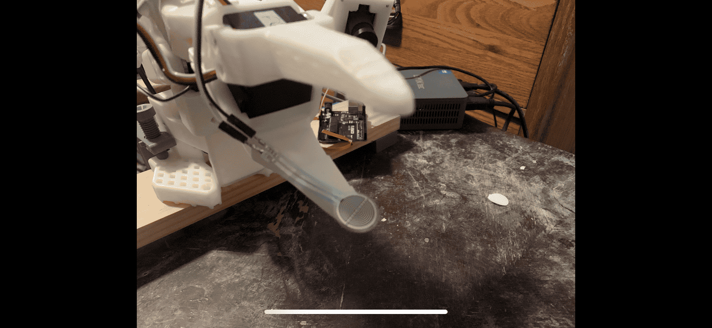
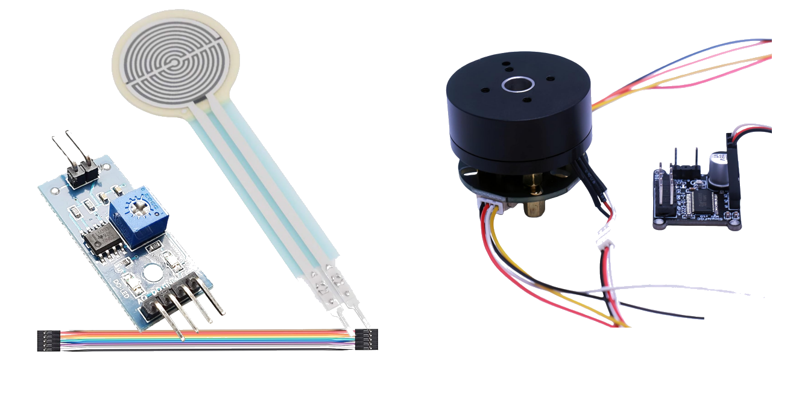
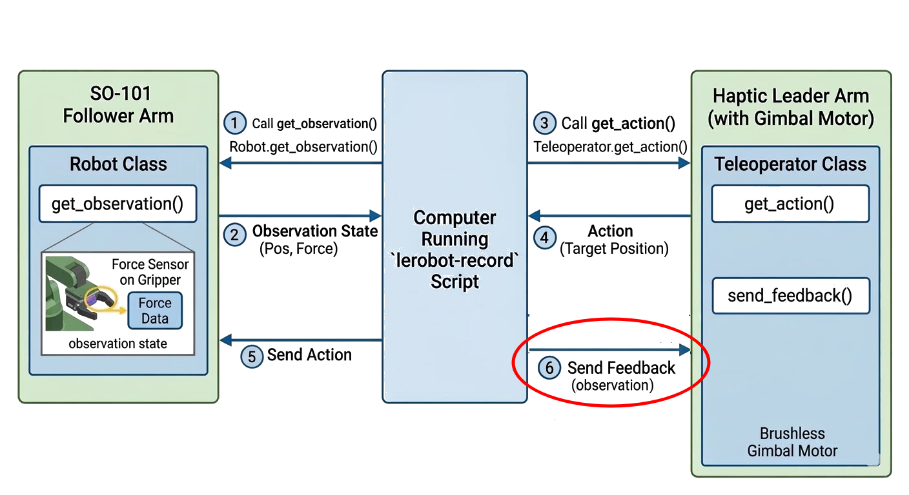
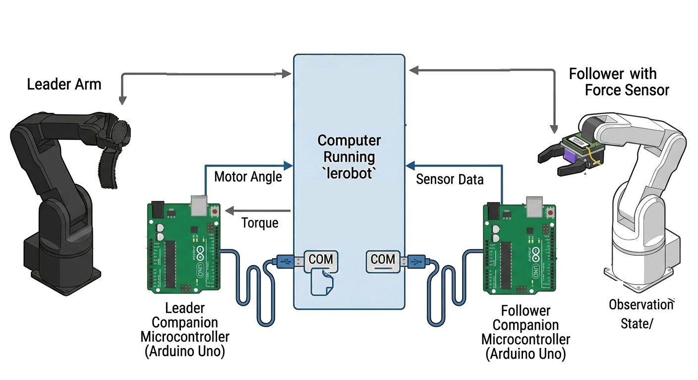

# Force Feedback for LeRobot SO-101 teleoperator

This project extends the SO-101 Leader (teleoperator) / Follower (robot) by adding haptic feedback at the gripper joint. Without feedback, operators tend to squeeze too hard when manipulating objects. These teleoperator actions then enter the training dataset and are imitated during policy inference.

Force feeback during teleoperation allows the operator to use appropriate gripping force, thereby avoiding dropping objects (too little force) or damaging delicate objects and causing excess stress and heat in the robot's gripper motor (too much force).

## Method
A force sensor is added to the end effector of the robot, and a 2804 brushless outrunner "gimbal" motor is used as the final joint of the leader to provide force feedback to the operator. The motor is controlled with a SimpleFOC mini v1.0 with an AS5600 Magnetic Encoder communicating with an arduino Uno over I2C.

The force sensor's readings are included in the robot's observation state. The lerobot-teleoperate and lerobot-record loops are (minimally) modified to provide feedback from the robot to the teleoperator (via the leader's send_feedback() method).


## Software Integration
Each arm inherits from the standard so-101 base class for its type, leader and follower, and adds code only for the new functionality.
```python
class FeedbackLeader(SO101Leader):
    ...
    @property
    def action_features(self) -> dict[str, type]:
        return { **super().action_features, "gimbal.pos": float }
    ...
```
Conveniently, LeRobot ecosystem automatically detects new robots and teleoperators installed in your python enviornment, as long as certain naming conventions are followed (https://huggingface.co/docs/lerobot/en/integrate_hardware).<br>
This makes it easy to use LeRobot's scripts like lerobot-record to create training datasets, to train a policy, and then to run inference on that policy on the modified hardware. The script lerobot-record requires just one added statement to send the robot's observation back to the leader as feedback:
```python
teleop.send_feedback(obs)
```
This functionality was contemplated by the LeRobot team. If you look at lerobot/teleoperators/so_leader/so_leader.py, you can see:
```python
def send_feedback(self, feedback: dict[str, float]) -> None:
    # TODO: Implement force feedback
    raise NotImplementedError
```
And my implementation is quite simple:
```python
def send_feedback(self, feedback: dict[str, float]):
        '''
        When gripping an object, force reported by the robot is scaled by
        GRIP_FEEDBACK_SCALAR (a property of this class, FeedbackLeader) to
        determine torque exerted by the feedback motor on the teleop.

        The gimbal motor has continuous rotation. To indicate the "fully open"
        position to the operator:
        when the teleop gripper control is significantly more open than the
        robot's gripper, a simulated spring (with displacement "error") acts
        to push the feedback motor toward the gripper "closed" position.
        '''
        # During gripping
        if feedback["sensor.force"] > self.SENSOR_DEADBAND_THRESHOLD:
            return self.feedback_motor.write(- self.GRIP_FEEDBACK_SCALAR * feedback["sensor.force"])
        # During jaw wide open
        error = self._gimbal_position - feedback["gripper.pos"]
        if error > self.TELEOP_EFFECTOR_TOO_OPEN_THRESHOLD:
            return self.feedback_motor.write(self.JAW_OPEN_SCALAR * error)
        # Gripper in normal range & not touching anything
        return self.feedback_motor.write(0)
```
A class is created to handle the sensor (ForceSensor), and another class to handle the feedback motor (FeedbackMotor), and each is managed by its respective arm.

## Hardware / Architecture
The leader and the follower each get a companion microcontroller (I used arduino Uno's). The Uno's are each attached to the computer (that runs lerobot) by a com port over USB. The modified lerobot code sends serial commands to the Uno's to read state (sensor readings and gimbal motor angles), and, for the feedback motor, also to write torques.


## Install
New robot and teleoperator embodiments must be installed in your lerobot virtual environment following specific naming conventions for lerobot to recognize them.  The following will install lerobot_robot_so_sensor_arm and lerobot_teleoperator_feedback_leader in editable mode so you can modify the code.

Clone this repo. cd into it. Ensure your lerobot virtual env is activated, and:
```shell
pip install -e .
```

## Use
I have copied the script from lerobot-record into this project's example/reference directory (and made the one-line modification). To run it, cd into the examples direcoty and run
```shell
bash record_with_feedback.sh
```
*Note:* If, during setup testing, you run lerobot-record again with the same *dataset.repo-id*, LeRobot will error and crash, complaining that file already exists at ~/.cache/huggingface/lerobot/huggingface-user/repo_name, and you just have to delete that file to get going again.

## Results
TODO

## More
When manipulating rigid objects, the force sensor can come on quite strong when contact is made, and tends to jump up to near the top of its range. This was causing the feedback motor to bounce back right after gripping an object, causing the robot's jaw to open. While this presents an interesting engineering challenge to solve in software, I found that the easiest way to resolve the issue is by adding some compliant material in the gripper. I placed a small piece of compressible foam on the side of the jaw opposite the sensor, and this helps quite a bit. There are also  designs for compliant jaws that get printed from flexible material:<br>
https://github.com/TheRobotStudio/SO-ARM100?tab=readme-ov-file#6-compliant-gripper<br> https://www.gauravmanek.com/blog/2025/fin-ray-gripper/<br>
and let's just say that's on my wish list. 

## Small Notes
At the time of writing (March 2026), I am using lerobot 0.4.4 with python 3.10.19

I put lerobot>=0.4.3 in pyproject.toml, somewhat arbitrarily, and you can probably roll that back if you need to.
